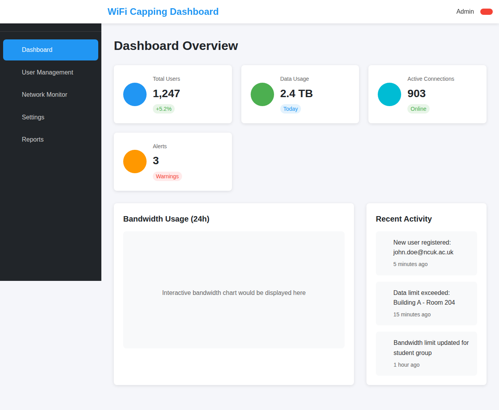
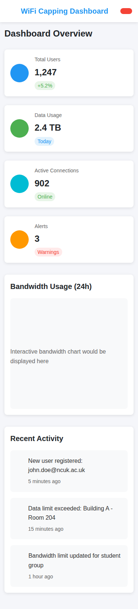
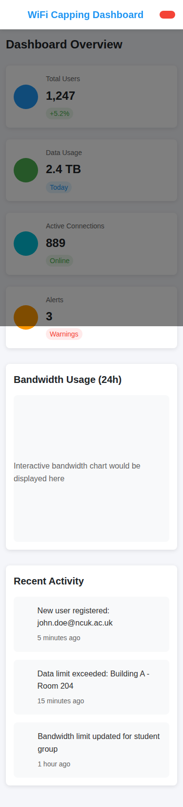
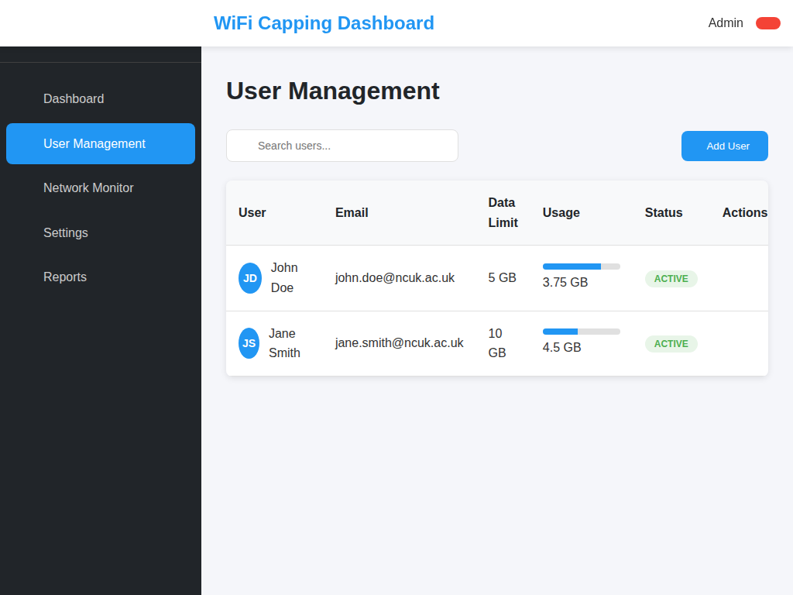
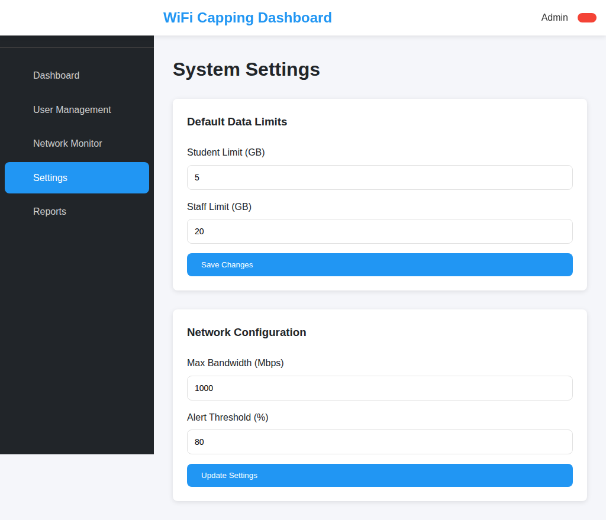
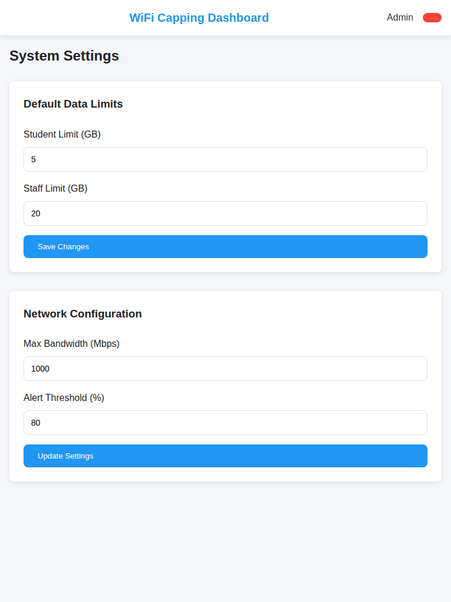

# WiFi Capping Admin Dashboard - NCUK

A responsive admin dashboard for managing WiFi bandwidth capping at the Northern Consortium UK (NCUK).

## Features

### 📊 Dashboard Overview
- Real-time statistics display (Total Users, Data Usage, Active Connections, Alerts)
- Interactive bandwidth usage charts
- Recent activity feed with live updates
- Responsive stat cards that adapt to different screen sizes

### 👥 User Management
- Comprehensive user table with search functionality
- User avatars and status indicators
- Data usage progress bars
- Edit and delete user actions
- Add new user functionality

### 📡 Network Monitoring
- Current bandwidth utilization meter
- Network health indicators
- Real-time monitoring capabilities

### ⚙️ System Settings
- Configurable default data limits for students and staff
- Network configuration options (bandwidth limits, alert thresholds)
- Form validation and settings persistence

### 📈 Usage Reports
- Exportable usage reports
- Date range selection
- Summary statistics

## Responsive Design

The dashboard is fully responsive and optimized for:

- **Desktop** (1024px and above): Full sidebar navigation with all features visible
- **Tablet** (768px - 1023px): Adapted layout with responsive grids
- **Mobile** (up to 767px): Collapsible hamburger menu, single-column layouts, optimized touch targets

### Key Responsive Features
- Mobile-first CSS approach
- Flexible grid systems using CSS Grid and Flexbox
- Collapsible sidebar navigation for mobile devices
- Responsive data tables with horizontal scrolling on small screens
- Touch-friendly button sizes and interactions
- Optimized typography scaling

## Technology Stack

- **HTML5**: Semantic markup structure
- **CSS3**: Modern styling with CSS Grid, Flexbox, and CSS Variables
- **Vanilla JavaScript**: Interactive functionality without dependencies
- **Font Awesome**: Icon library for consistent iconography

## Screenshots

### Desktop View


### Mobile View  


### Mobile Menu Open


### User Management Section


### Settings Page


### Tablet View


## Usage

1. Open `index.html` in a web browser
2. Or serve the files using a local web server:
   ```bash
   python3 -m http.server 8080
   ```
3. Navigate through different sections using the sidebar menu
4. Test responsiveness by resizing the browser window or using browser developer tools

## Browser Support

- Chrome 60+
- Firefox 55+
- Safari 12+
- Edge 79+

## Accessibility Features

- Semantic HTML structure
- ARIA labels and roles
- Keyboard navigation support
- High contrast color scheme
- Screen reader friendly
- Focus indicators

## Development

The dashboard uses modern CSS features and vanilla JavaScript for optimal performance and compatibility. No build process required - simply open the HTML file in a browser.

### File Structure
```
├── index.html          # Main dashboard HTML
├── styles.css          # Responsive CSS styles
├── script.js          # Interactive JavaScript
├── README.md          # Documentation
└── .gitignore         # Git ignore rules
```